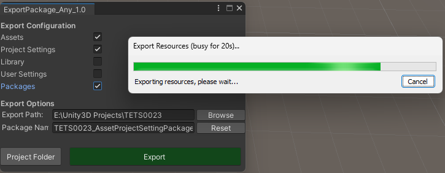

## PackageExporter_ForUnity

#### A Unity3D Custom Package Exporter that can export anything as a .unitypackage.

**version **[1.0-beta_090823]() by **sangko-dgq**

Unity Custom Package Exporter is a Unity Editor tool that allows you to export a wide range of project assets and settings into a Unity package. By default, Unity's built-in package export functionality primarily exports scene-related assets. This custom tool extends the export capabilities to include additional project-wide settings like ProjectSettings, Library, UserSettings, and Packages.

## Features

- Export a wide range of assets and settings, including:
  - Assets (including scenes and scripts)
  - ProjectSettings
  - Library
  - UserSettings
  - Packages
- Customizable export options to tailor your package contents.
- Convenient GUI interface for selecting export options and destination folder.

## Installation

1. Clone or download this repository.
2. Copy the `ExportPackage_withAny.cs` script into your Unity project's `Editor` folder.

## Usage

1. Open Unity Editor.
2. Go to the "CustomTools" menu.
3. Select "ExPackage_Any_1.0" to open the custom package exporter window.
4. Configure your export options:
   - Check the boxes for the types of assets/settings you want to include in the package.
   - Choose the export path by either typing it in or clicking the "Browse" button.
   - Enter a package name or use the "Reset" button to generate a default package name.
5. Click the "Export" button to initiate the export process.
6. Confirm the export when prompted.

## Example Package Contents

- If you select "Assets" and "ProjectSettings," the resulting package may include project assets and settings.
- If you select "Library," the package may contain cached Unity library files.
- If you select "UserSettings," the package may include user-specific settings.
- If you select "Packages," the package may contain Unity Package Manager packages used in the project.

## Contributing

Contributions and bug reports are welcome! If you encounter any issues or have suggestions for improvements, please open an issue or create a pull request.

## License

This project is licensed under the MIT License - see the [LICENSE.md](LICENSE.md) file for details.